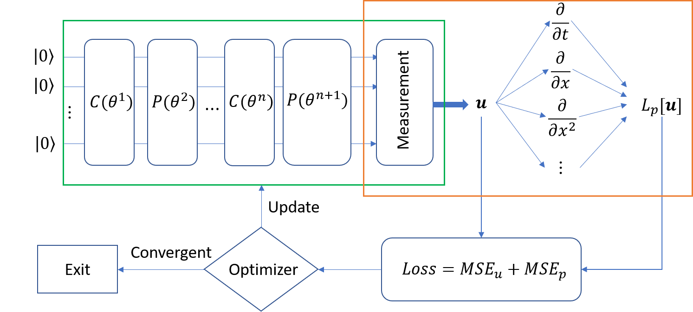

# PIQDNN_FOR_PDE

This is the AD for the paper: Physics-informed Quantum Deep Neural Network for Solving PDEs. 

The structure of the PIQDNN is illustrated as follows:

## Explanation
The source code for building the model and training, and the illustration of the model can be found unde: /src. 

The training dataset can be found in: data/burger, data/poisson

The results of some of the experiments can be found in: /results

## How to run it
The configuaration for the environment can be found in requirement.txt, the docker image for this implementation is in preparation, could be provided upon request.
run the training:

running the Poisson model:
     python3 src/main.py Poisson
     
running the Burger model:
     python3 src/main.py Burger
     
The model detail can be modified within the main.py file.

