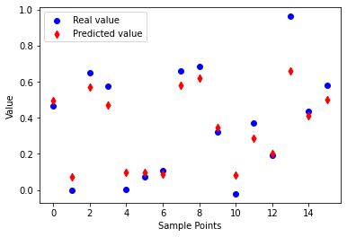
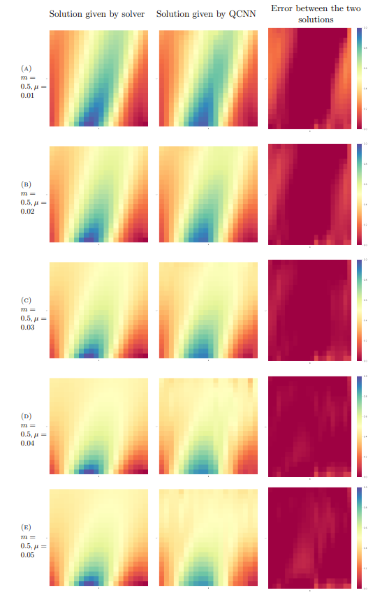
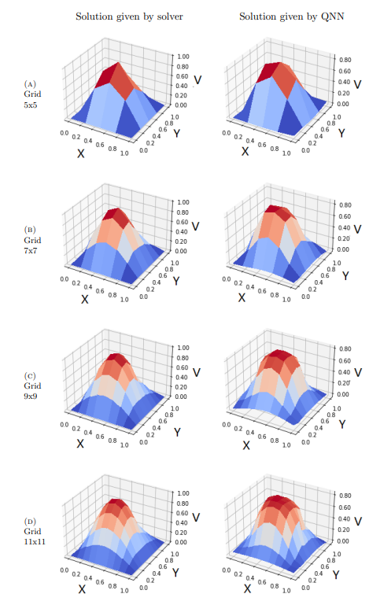

# Results of some experiments:

## Result of the experiment: 1D Burger's Equation

#### The predicted result and real value in some random data point

#### The comparison between predicted result by PIQDNN and result given by analytical solution on the dataset of Burgers equation

## Result of the experiment: 2D Poisson Equation

#### The comparison between predicted result by PIQDNN and result given by analytical solution on the dataset of Poisson equation

